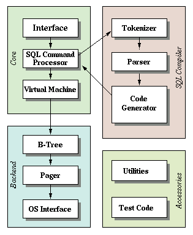

## sqlite db clone
A SQLite db clone.

**note**: code is referenced from: https://cstack.github.io/db_tutorial/

**purpose**: to apply learnings from [CMU Intro to Database Systems course](https://www.youtube.com/watch?v=otE2WvX3XdQ&list=PLSE8ODhjZXjYDBpQnSymaectKjxCy6BYq).

## what ##
A single table database stored in a `.db` file.

Table fields:
- id: int32
    - primary key, sorted
- username: varchar(32)
- email: varchar(255)

## architecture
Project architecture is modelled after [SQLite's architecture](https://sqlite.org/arch.html).

The data in the `.db` file is stored sequentially - just a list of records. Once a cache miss occurs, the `.db` file is loaded into memory as pages. 

The table is stored as a B+ tree - like most database systems. Each node in the tree is equivalent to a database page.

A database cursor is used to traverse tree. If node/page is full, new node/page is allocated through node splitting.

Once all operations are completed, `.exit` will flush the cache into the `.db` file - ensures data persistence.



## setup
### CMake
Ensure CMake is installed on computer.

macOS
```
brew install make
```

### running project
```
make
./build/db_sqlite foo.db
```
- foo.db: any filename to store data

## examples
### commands 
- `select`
- `insert`

### meta commands
- `.exit`
- `.print_tree`

#### `select`
Performs a `SELECT *` on data in `.db` file.

```
$ db -> select
1, hello, hello@world.com
2, john, john@appleseed.com
completed.
```

#### `insert`
Inserts an ID, username, email into `.db` file.
```
$ db -> insert 3 bar bar@test.com
completed.
```

#### `.exit`
Closes database connection, frees memory, flushes cache to `.db` file.

This command must be ran to save data. If program terminated, data modified during session will *not* be saved.

```
$ db -> .exit
```

#### `.print_tree`
Prints the tree out. *Currently, only prints out leaf node which database cursor is on*.

```
$ db -> .print_tree
- 2: 2
- 3: 3
- 4: 5
```

Prints `cell number: primary key (id)`.

## todos
- improve error handling/messaging
- update `.print_tree` to reflect entire tree
- add testing
- scale to multiple tables